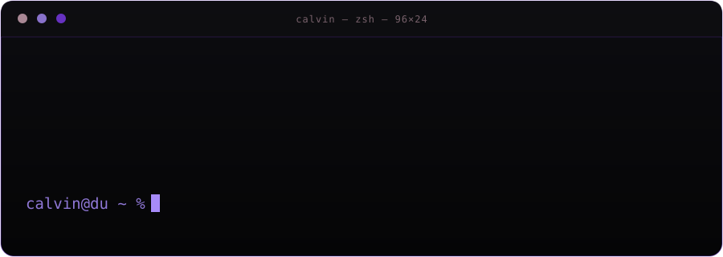

  

 

## ▚ 关于我 / About

  

Calvin Du · AI Agent 工程 × 数据分析 × 合规风控 · NUS ISE · Building Crewmind

 

杜文韬（**Calvin Du**）—— AI Agent 工程 × 数据分析 × 合规风控交叉背景。新加坡国立大学（NUS）工业与系统工程硕士在读（运筹与数据方向），南京大学商学院财务管理学士（GPA 3.79/4.00）。做过合规科技、审计自动化、商业化风控、GRC，也独立设计并维护一个自托管的多人协作 Agent 平台。

*Bridging AI agent engineering, data analytics, and compliance/risk. NUS ISE (Operations Research & Analytics); BA in Finance, Nanjing University. Now building Crewmind solo.*

| **50+** | **287+** | **8h → 2h** | **12+** |
|:---:|:---:|:---:|:---:|
| 工具 / Skill / 插件交付 | commits · crewmind | 合规月报自动化耗时 | 法律业务场景覆盖 |

---

## ▚ 精选项目 / Featured Work

#### 🧩 [crewmind](https://github.com/1518213712-eng/crewmind)

自托管的多人协作 AI Agent 平台 —— 团队在类 IM 群聊里共同指挥服务器端 agent，而不是各自单开一个聊天窗口。多模型运行时（Claude Agent SDK / Codex / DeepSeek harness 桥接）、团队空间与额度治理、文档工作区，Web / PWA / macOS 三端覆盖。独立设计与开发，287+ commits。

*A self-hosted, multiplayer AI agent workbench — teams command server-side agents together inside a group chat, instead of running solo chat windows. Multi-model runtime, team/quota governance, a document workspace, across Web / PWA / macOS. Solo project, 287+ commits.*

`Claude Agent SDK` `MCP` `TypeScript` `Node.js` `多人协作运行时`

  
   
  crewmind 视觉基调（设计素材，非产品截图）

 

| 项目 | 说明 |
|---|---|
| 🏛️ [**mingwen-law-workbench**](https://github.com/1518213712-eng/mingwen-law-workbench) | 律所数字化工作台 —— TypeScript + Cloudflare Workers |
| 🚗 [**calvin-auto-compliance-briefing**](https://github.com/1518213712-eng/calvin-auto-compliance-briefing) | 汽车数据合规快讯生成工作台，与 Dentons 实习产物同方向 |
| ⚖️ [**legal-ai-presentation**](https://github.com/1518213712-eng/legal-ai-presentation) | 法律 AI 培训 / 演示材料 |
| 🏚️ [**empty-house-letter**](https://github.com/1518213712-eng/empty-house-letter) | 《空屋来信》—— 原生 JS 视觉小说解谜游戏（业余作品） |
| 🎓 [**Admission-show**](https://github.com/1518213712-eng/Admission-show) | AbroadSync 留学申请展示平台 |

---

## ▚ 技术栈 / Stack

**Agent / AI**

**数据 / Data**

**工程 / Engineering**

**合规 / Compliance**

---

## ▚ 经历一览 / Experience

按时间倒序，仅列关键产出，完整信息见简历。

- **ShopeePay**（新加坡）· Agent 产品助理 —— 在职
- **大成律师事务所 Dentons**（杭州）· 数字化转型实习 —— 合规快讯生成器（Grok API 结构化抓取，月度耗时 8h→2h）；律所风格 PPT 生成 Skill（Codex + DeepSeek，20 页汇报一键生成）；累计开发部署工具/Skill/插件 50+；全国合伙人 AI 培训讲师
- **中国电信**（北京）· 审计数据分析实习 —— 本地审计工具链（离线 OCR、SQL 风控逻辑结构化）
- **字节跳动** · 商业化风控实习
- **特斯拉** · GRC 实习 —— Python 替代人工核对、SOX 证据链
- **安永 EY** · 审计实习

**教育**：新加坡国立大学（NUS）工业与系统工程硕士，运筹与数据方向（2026.09–2027.05）· 南京大学商学院财务管理学士，GPA 3.79/4.00，人民奖学金 / NUS-CDE 奖学金

---

  

  

  联系方式见简历 / 求职投递渠道 · Contact via resume / application channel
   
  此页面为求职展示用个人主页 · This profile is maintained for job search purposes

